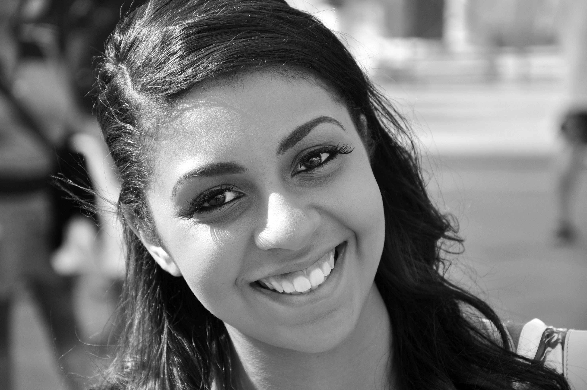
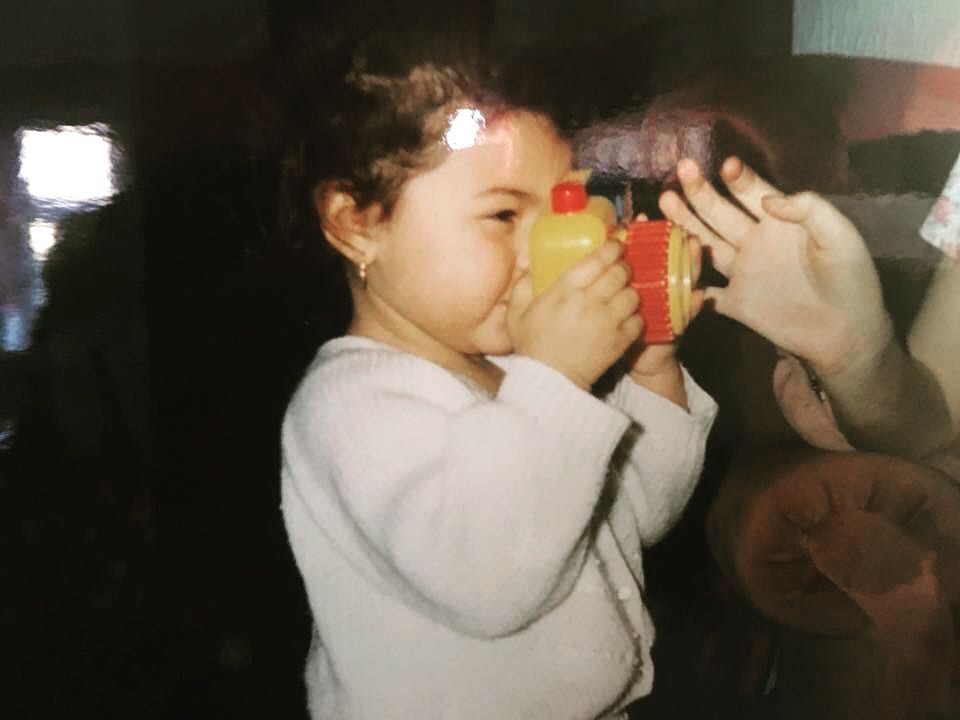

## Hey!

I’m Ieashia (with an i) the photographer behind the lens of ISJ Photography.

Based in Essex, with a love for travel.

I am a visual storyteller and I would love to tell your story. Candidly capturing you and your family, showcasing the very best of you: your relationships, your commitment to each other, your beginnings, your family – but most of all your love.

Capturing moments and memories is my passion. For me, there is nothing better than looking back at a photograph and all the memories, feelings, happiness and laughter of that moment come rushing back to you.

My passion for photography started when I was a child.

I remember my granddad sitting me on his knee and showing me how to use his 35mm camera: from putting in the film to explaining how important it is to capture the right moment! He’d say, 
> “There are only 27 shots, so we don't want to waste one!”

From that point on, I was hooked!

After my grandad inspired me to love amateur photography throughout childhood, at 18 I decided to make it my profession.

So, I studied Digital Photography at London Southbank University and am proud to say that I graduated with a BA (Hons) degree.

Nowadays we have digital cameras, and so lots more chances to catch the perfect shot. But these beginnings using film cameras has served me well. It made me have patience to wait for these moments and use my skill to frame and find the perfect moment to freeze, rather than just taking a hundred shots and hoping that quantity would bring the quality in a few of them.

Images caught this way can take you back to the most precious moments of your life to revisit those happiest of feelings anytime you like. You can look at your well-worn husband of 20 years like you’re newly in love and engaged or just married again. You can look at your grumpy teenager like they’re that precious little baby again. You can look at a family portrait with a loved one who is no longer with us again and feel their presence.

I don't dictate the moments, I capture them.

Let me tell your story, 

Ieashia

