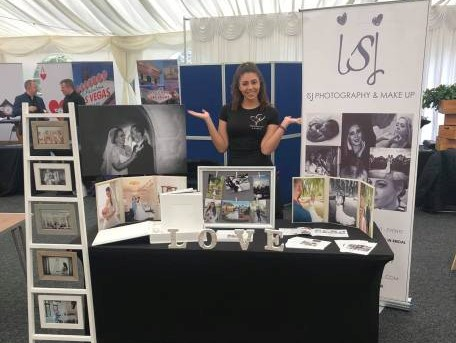
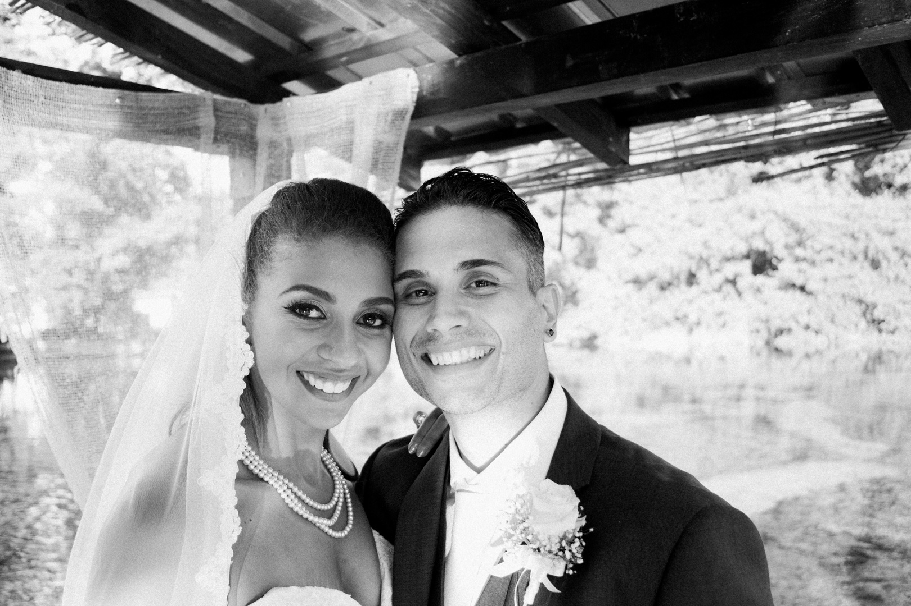
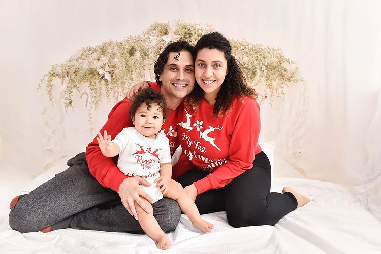

## Hello

I’m Ieashia, the photographer behind the lens of ISJ Photography. 

My passion for photography started back in childhood. 

My grandad was a keen photographer. He sat me on his knee and showed me his 35mm camera. He patiently taught me how it worked: how to put the film in, and how to wait for the exact right moment to capture the shot just right. I was mesmerized at this seeming magic. He used to say “There are only 27 shots, so we don’t want to waste any!” 

From that point on, I was hooked! 

Luckily nowadays we have digital cameras, and so lots more chances to catch the perfect shot. But these beginnings using film cameras has served me well. It made me have patience to wait for these moments and use my skill to frame and find the perfect moment to freeze, rather than just taking a hundred shots and hoping that quantity would bring the quality in a few of them. 

It gave me a respect and reverence for the magic of photography, which clients tell me comes across in the moments I preserve for them. 

Capturing moments and memories is my passion. To catch a special fleeting flash of something feels like freezing time in the image. Images caught this way can take you back to the most precious moments of your life to revisit those happiest of feelings anytime you like.  

You can look at your well-worn husband of 20 years like you’re newly in love and engaged or just married again. You can look at your grumpy teenager like they’re that precious little baby again. You can look at a family portrait with a loved one who is no longer with us again and feel their presence. 

Any moment you want to preserve, you can have. 

Looking back at precious photos like this gives you the closest we can get to having a time machine, and it brings happy memories flooding back anytime you want them to.

I’ve worked as a professional photographer since 2010. I’ve worked hard to earn the skills and keen eye to capture moments that I have now. I didn’t just pick up a camera and call myself a photographer after being passable at editing photos of my baby on Instagram. 

Being a photographer is what I’ve always done. 

After my grandad inspired me to love amateur photography throughout childhood, at 18 I decided to make it my profession. So, I studied Digital Photography at London Southbank University and am proud to say that I graduated with a BA (Hons) degree. 

I then worked as a photographer for magazines, night clubs, fashion and even TV events. 

I wanted to travel, so combined that with my photography skills and passion, and worked as a cruise ship photographer from 2014 to 2015. Cruise ships was where 
I really found my feet, my flow and the type of photography I wanted to pursue. 

On ships, I also found a real love for makeup. I have always enjoyed makeup, and my favourite part of any night out was always getting ready, putting my make up on with friends while dancing about to my favourite songs. 

I brought this love and skill into my photography work on ships, by doing the cruise guest’s makeup for them before their photo shoots. Seeing how it transformed their presence, postures and confidence in front of the camera was amazing, and so rewarding. 

I then trained to become a makeup artist so I could bring both aspects together in one business. I offer my makeup artistry skills available with all types of photo shoots (except for babies, of course. They are perfection already) in case you’d like a little extra confidence and sparkle on your shoot day.

Cruise ships were also where I found my amazing husband Zoran. 

He was a handsome hairdresser on the ship, from Macedonia, and we fell in love right away. We sailed the seven seas together for 2 years and then decided to take our adventures back to land so we could eventually start our own family. 

We moved to Essex in 2015 and I’ve been running ISJ Photography ever since. Zoran and I also run our own makeup and hair company, Krstev Kreates, together. We offer packages for hair and makeup, specialising in weddings. We are available for all types of packages with this if you like too, such as engagement, maternity and family portraits (again, just not the babies). 

We got married in Macedonia in September 2017, and on Valentine's Day 2020 our adorable baby boy Reggie arrived. 

I am a visual storyteller and I would love to tell your story. 

My favourite thing is to snap the pivotal moments when families come together: when couples commit to each other, when new babies are born and when whole new families want to take portraits to encompass new members.

I work with a very relaxed approach, always making sure my clients feel 100% comfortable at their photo shoot. Check out my testimonials to see what my happy clients say.

I have my own recently-renovated photo studio in my garden, so it is a completely private, relaxed, secluded and Covid-safe haven to have your portraits taken in. 

I’ll candidly capture you and your family, showcasing the very best of you, your relationships, your commitment to each other, your beginnings, your family – and most of all, your love.

I don't dictate the moments, I capture them.

Let me tell your story,

